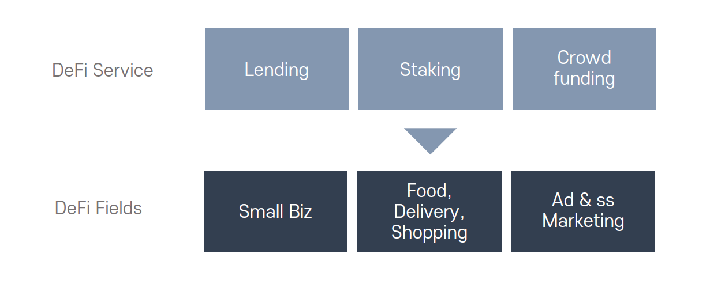
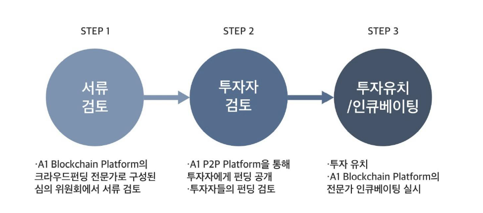

# AOT Blockchain Platform

AOT Blockchain Platform은 이더리움 기반 스마트 컨트랙을 활용한 DeFi 플랫폼 프로젝트 이다. 현재 급성장하는 DeFi(Decentralized Finance) 산업의 다양한 분야에 적용되는 블록체인 서비스들을 진행하며 사업 분야는 크게 다음과 같다.

**- 소상공인을 위한 랜딩, 스테이킹, 크라우드 펀딩 상품(파생상품 포함) 을 통한 탈중앙화 금융 서비스**

* 소상공인 대출 : 신용카드 가맹점 매출 담보로 한 가상자산 대출 서비스
* 구매 자금 대출 : 원자재, 식재료 등 구매자금 소요에 대한 소상공인 가상자산 담보 제공
* 스테이킹 서비스 : 신용카드 가맹점의 가상자산 스테이킹 서비스 및 가맹점 수수료 할인 서비스
* 가상자산 이자 보상 서비스 : Smart Contract로 이루어진 DeFi 상품에 유동성을 공급하고 보상을 지급하는 DeFi 서비스

**- 소상공인 대상 소액 결제 시스템**

* 소상공인 신용카드 가맹점의 가상자산 결제 및 할인 서비스
* **음식점, 배달업체, 상가, 광고, 마케팅 서비스 소상공인을 위한 가상자산 결제 서비스 등**

AOT Blockchain Platform은 이더리움 2.0 으로 업그레이드 되는 2023년 하반기 시점 부터 PoS(Proof of Stake) 기반의 Blockchain 플랫폼으로 개발된다.

AOT Blockchain Platform 서비스 생태계는 다음과 같다.

## 소상공인 대상 DeFi 서비스

**- 에이원토스(AOT) 담보대출(Lending)**

에이원토스(AOT) Blockchain Platform 에서 운영하게 될 에이원토스(AOT) Exchange의 DeFi 서비스 중 Lending 서비스는 에이원토스(AOT) Coin 및 BTC, ETH 등 가상 자산을 담보로 하여 토큰에 투자할 수 있는 가상자산 투자 플랫폼이다.

투자 이율은 1.5%(년)\~ 15%(년) 까지 대출 기간과 담보 가상자산에 따라 달라지며 대출자의 대출금 관리 서비스, 시세 변동에 따른 리스크 관리 등을 제공하며, 크라우드 펀딩으로 모집된 금액으로 제공되며, 향후 글로벌 파이낸싱 벤처 캐피탈과 연계하여 리스크를 관리한다.

**- 에이원토스(AOT) 크라우드펀딩(Crowd Funding)**

에이원토스(AOT) Blochchain Platform에서 제공하는 Crowding 투자 플랫폼은 전문가 집단으로 구성된 심의 위원회의 1단계 서류 검토를 통해 접수된 신규 프로젝트들에 투자하게 된다. 투자자 멘토 클럽 매칭 시스템에 의해 분류되어 투자자에게 공개 된다. 2단계 투자가 성공적으로 진행되면 3단계 전문가 인큐베이팅을 실시하여 성공의 가능성을 더욱 극대화 한다.

## 소상공인 대상 결제 및 보상 시스템

에이원토스(AOT) Platform는 상거래 결제 플랫폼이다. 에이원토스(AOT)는 블록체인 기술을 활용하여 상거래 결제에 카드 혹은 현금의 단순한 결제수단에서 온라인의 결제수단과 플랫폼사들의 결제 수단(카드, QR코드 상품권, 휴대폰 소액결제, 가상자산, 디파이 등)까지 다양한 결제단을 제공한다.

* 실물 경제에 블록체인 기반의 결제 생태계 구축
* 직 가맹점 결제 시 결제 대금의 3-5% 리워드 제공
* 직 가맹점이 아닌 경우 삼성페이로 결제 가능 (리워드 없음)
* 현재도 활발히 진행 중인 결제 솔루션 사업의 수익을 재원으로, 에이원토스(AOT) Token 홀더에게 스테이킹 리워드 지급
* 상거래 결제하기 위한 법적화폐 포인트로 전환 가능
* 포인트로 전환 시 회수된 에이원토스(AOT) Token 은 자동 소각 됨으로 장기적인 희소성 가치가 높음
* 오프라인 소상공인 가맹점으로의 고객 유치를 위한 참여형 AR O2O 서비스 제공으로 사용자 참여 도모 및 리워드 제공

