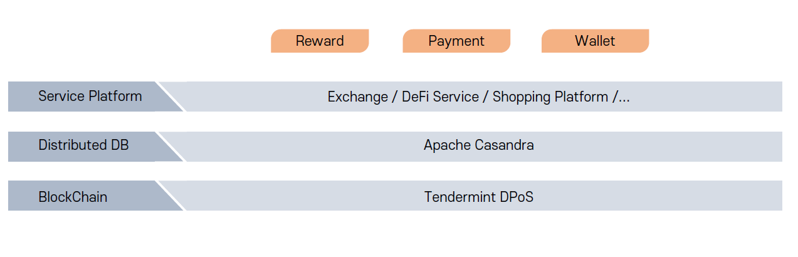

# AOT Blockchain Technology

AOT 프로젝트는 향후 더 빠르고 보안에 강한 메인넷 구축을 위해 텐더민트 오픈소스를 활용한 플랫폼 구성에 참여합니다.&#x20;

Tendermint-cosmos는 텐더민트 합의 프로토콜을 가지고 있으며, 부분적 Synchronous BFT(Byzantine Fault Tolerant) consensus protocol의 개념을 갖는다. 다시 말하면, 텐더민트는 DPoS(Delegated Proof-of-Stake)개념과 PBFT 개념을 섞은 합의 알고리즘이다. Tendermint-cosmos의 특징으로는 상호운영성을 들수 있다.이는 블록체인의 잠재력이 극대화되기 위해서는 “통일된 프로토콜"을 바탕으로 “블록체인이 서로 연결되는 인터넷"이 만들어져야 합니다.

## AOT 메인넷 구조

AOT 메인넷 구조는 상위와 같습니다. Tendermint의 DPoS 기반의 블록체인과 Apache Casandra 의 Distributed DB Layer를 구성하고 Exchange / DeFi Service / Shopping Platform 등 여러가지 플랫폼을 구성한다. 컨트랙을 활용한 Reward 보상을 위한 기능과 Payment, Wallet 기능과 같은 어플리케이션 기능으로 구성되어 있습니다.&#x20;

**아파치** **카산드라**(Apache Cassandra)는 자유-오픈 소스 분산형 [NoSQL](https://ko.wikipedia.org/wiki/NoSQL) 데이터베이스 관리 시스템의 하나로, 단일 장애점 없이 고성능을 제공하면서 수많은 서버 간의 대용량의 데이터를 관리하기 위해 설계되었습니다.&#x20;

카산드라는 여러 데이터 센터에 걸쳐 클러스터를 지원하며 마스터리스(masterless) 비동기 레플리케이션을 통해 모든 클라이언트에 대한 낮은 레이턴시 운영을 허용합니다. AOT 메인넷 플랫폼은 분산형 데이터베이스 (The Distributed Database)와 같은 블록체인의 모든 노드에게 데이터를 저장할 수 있는 내장형 데이터베이스가 필요하게 되며, 분산형 블록체인 어플리케이션의 특성상, 해당 노드가 블록체인의 모든 노드에 복제되고 동기화 됩니다.

## AOT 블록체인 특징

고객과 가맹점(판매자),광고 사업자,결제 사업자를 서로 연결해주는 플랫폼을 구성 하여  편의와 실용성을 제공하고 만들어진 플랫폼 안에서 디파이서비스, 간편 결제 서비스, 보상체계, 신개념 광고 시장, 신규 수입원을 창출합니다.  AOT Coin을 서로 다른 기업 포인트 스왑하여 사용함하여, AOT Coin의 수요를 상승시키며, 코인의 가치를 높입니다. AOT 플랫폼에서 발생하는 이익을 기반으로 고객과 판매자와 광고주에게 더욱 높은 질의 서비스를 제공하여 선순한 구조를 이루어냅니다. 블록체인의 고유 기술을 이용하여 고유 번호를 발급하고 사용하여지는 것을 전부 자료화 하여 DB를 형성하고 빅데이터를 활용해 각종 시장 분석 및 사용자 맞춤형 광고를 할 수 있게 하는 등 적극적인 시스템 사용에 집중합니다. 이는 차후에 블록체인 기반의 빅데이터 산업에 진출할 수 있는 가능성 또한 제시하며, 현실과 가상이 합쳐져 있는 증강 현실 기반 기술을 사용하여 사용자에겐 직관성과 재미를, 판매자에겐 높은 질의 API를 제공하여 플랫폼의 가치를 한층 더 가치 있게 만들어나가고자 합니다. 이 모든 부분을 취합하여 최종 목표로 하는 것이 바로 슈퍼클라우드 이며 이 실제 결제 생태계 안에서 모두가 상생하는 비전을 나타냅니다.

AOT Platform는 안드로이드기반의 올인원결제단말기로 상거래 결제망이 구축되면서 결제되는 모든 정보의 데이터 베이스는 블록체인에 저장됩니다. 이는 AOT 컨소시엄블록체인에 참여하는 결제회사들이 모두 한 개가 원장을 공유하여 신뢰도와 보안을 강화 및 빠른 거래 속도를 제공하고, 프라이빗 블록체인의 일종인 컨소시엄블록체인으로 참여합니다.

컨소시엄 체인은 블록체인 결제 시스템에 참여하는 소수의 주체가 검증자역할을 하는 것으로, 시스템 규칙은 유연합니다. 검증자만이 체인을 볼 수 있거나, 허가된 개인 또는 모두가 볼 수 있다. 검증자들이 합의를 달성한다면, 변경 사항들은 쉽게 구현될 수 있기에 블록체인 결제 시스템을 결제시장의 변화에 따라 유연하게 변경, 대처가 가능하다. 즉 AOT의 컨소시엄 블록체인은 참여자의 특정 수 이상으로 해당 주체들이 정직하게 행동하면 시스템은 아무런 문제없이 기능한다. 이렇듯 컨소시엄 블록체인은 동일한 산업 내에서 운영되는 복합적인 조직 환경과 공통의 트랜잭션 또는 정보를 필요로 하는 곳에서 가장 유용합니다. 이러한 유형의 컨소시엄에 참여하면, 다른 회사와 자신들의 산업 인사이트를 공유할 수 있기 때문에, 조직에 이득이 될 수 있기에 스타트업 결제회사들의 참여가 쉽고 빠르게 확산될 것입니다.&#x20;

AOT Platform 컨소시엄 블록체인 결제시스템에서는 현재 PVC신용카드 결제시장과 앞으로의 스마트폰 APP TO APP 결제시장에 결제 망을 구축 하기 위하여 안드로이드기반의 결제 단말기를 개발하고 있습니다. 안드로이드결제단말기는 IC리딩과 MSR리딩을 지원하여 PVC신용카드와 삼성페이결제를 지원하며, NFC로 NFC카드(교통결합카드등)와 스마트폰의 NFC기반의 간편결제(애플페이등)를 지원합니다. 또한 초점식 카메라로 QR코드와 BAR코드를 기반으로 스마트폰 APP TO APP 결제 (카카오페이, 알리페이, 위쳇페이, 네이버페이, 제로페이, 시럽페이,웹카드등)를 지원합니다. 크립토 커렌시의 상거래 결제도 스마트폰의 APP TO APP 결제 방식으로 상거래에서 결제와 정산, 매출신고 등을 지원하게 됩니다.

