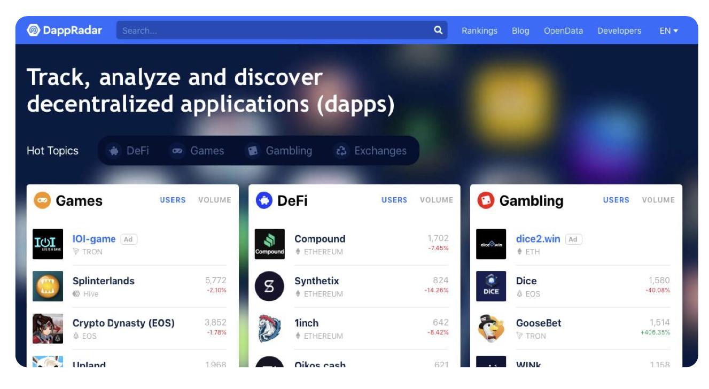
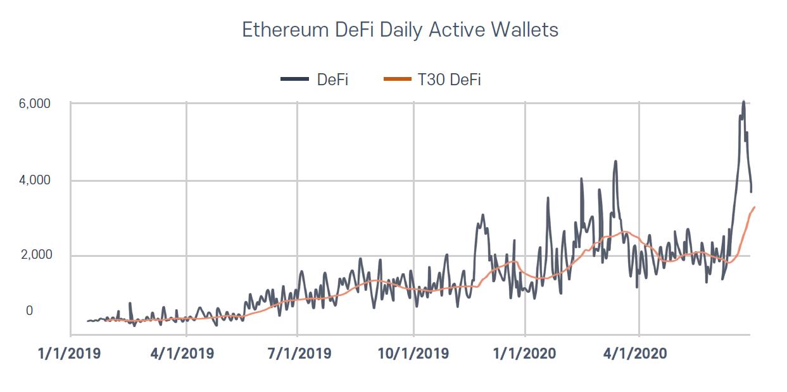
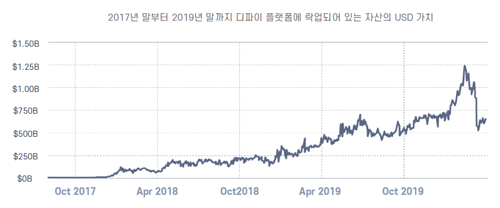
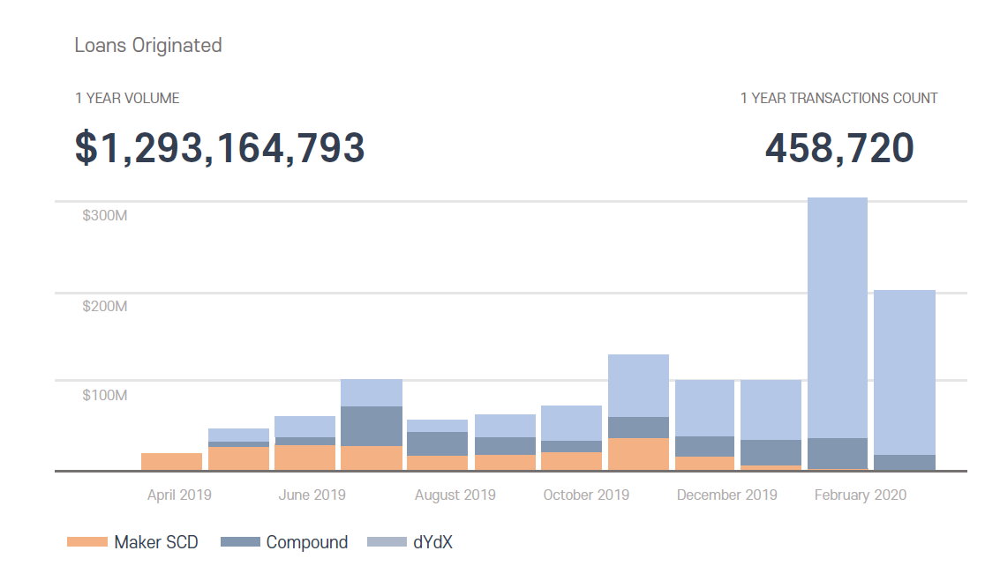
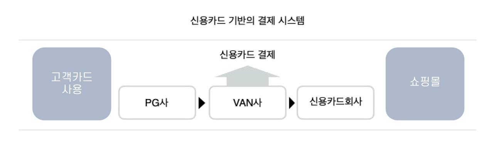

# 결제시장의 변화

## 부가가치통신망 결제대행사업자(VAN)의 탄생과 성장

가상자산이 상거래 결제시장에 생태계에 안착하기 위한 현재의 결제시장에 대한 결제사업자들에 대한 이해가 필요하다. VAN(value added network)이란. 한국통신(현 KT)과 같은 회선을 소유하는 사업자로부터 통신회선을 빌려 독자적인 통신망을 구성하고, 거기에 고도의 통신서비스를 부가하여 새롭게 구성한 통신망을 지칭한다.&#x20;

VAN은 1973년 세계 최초의 VAN 사업자가 미국에서 등장하여, 1975년에 텔레넷(TELENET)이, 1977년에는 타임넷(TYMNET)이 서비스를 개시하며 본격적인 VAN의 시대가 개막되었다. VAN은 같은 업종의 기업 간에 정보 교환을 통해 공동으로 업무 처리를 할 수 있도록 하며, 변환장치를 사용하여 기종이 다른 단말 장치 간의 정보 교환도 가능하게 한다. 또 기업 간에 공동 시스템을 구성하여 부가가치망 사업자에게 위탁.운영 시킴으로써 업무의 효율을 높일 수 있다는 점에서 사용되고 있다.

VAN은 단순히 컴퓨터의 고도 이용 촉진 뿐만 아니라 고도정보화 사회에 다각적인 정보 활용 수단을 제공한다는 점에서 중요한 의미를 갖고 있다. 각 업계에서는 업무연락의 신속성, 정확성, 일관성을 위하여 VAN을 공동으로 구축하여 이용 중에 있다.&#x20;

한국에서는 카드회사가 카드결제단말기 (CAT)를 VAN사(부가가치통신망으로 카드결제를 대행하는 사업자)에게 설치.운영을 맡기고 서비스이용료를 지불하면서 구축된 카드결제대행업체를 일컫는 말로 쓰이고 있다. 한국에서의 VAN은 카드결제가 보편화되는 1980년대 카드회사가 직접 처리하던 카드결제의 가맹점가맹과 카드결제단말기의 설치 및 운영을 맡기면서 탄생된 사업자이다. 가장 먼저 생긴 VAN사는 1996년 이지체크라는 브랜드명으로 익숙한 한국정보통신이다.&#x20;

카드결제시장이 성장하면서 1998년 코스닥에 상장하는 등의 성장을 이어갔고 이후에 한국신용정보, 한국신용평가, 한국부가통신등… 많은 VAN사들이 생겨났다. VAN사들의 주요 수입은 결제정보를 제공하면서 받는 수수료이다.

수수료는 결제금액과 상관없이 결제 건당 80원\~160원의 수수료를 책정하는 정액제와 결제금액에 비례하여 수수료를 지급하는 정률제가 있는데 카드회사는 2015이후부터 정액제가 아닌 정률제로 개편하고있다.&#x20;

VAN사는 1886년 아시안게임과 1988년 올림픽의 신용카드사용시장의 비약적인 발전을 하게 되었고, 1997년 불어닥친 외환위기 에서 정부는 대출자산 활용폭을 넓히고 신용카드 소득공제와 신용카드가맹점 공동이용제도(여러 개의 카드사와 직접 가맹을 맺지않고 1개이상의 카드사와 가맹점을 채결하면 한국에서 발행된 모든 신용카드를 취급할수 있게 만든 제도)를 도입하면서 커다란 변곡점을 맞이하면서 카드시장의 급성장과 더불어 VAN사들이 성장을 이루었다.

![\[한국정보통신(VAN사) 매출성장내역과 신용카드를 결제하기위한 CAT형 단말기\]](.gitbook/assets/한국정보통신\_20220624.png)

### 스마트폰의 탄생과 부가가치통신망의 위축

이렇게 VAN사가 결제시장이 주류로서 발전할 수 있었던 데에는 결제시장에서 신용카드의 결제 점유율이 높아진 것이 가장 큰 이유이다. 신용카드 점유율은 약 75%에 달하고 있으며, 거의 모든 사람들이 신용카드를 소지하거나 이용하고 있는 중이다.&#x20;

그러나 신용카드의 대명사로 여기었던 PVC카드의 시대가 곧 사라질 것이다. 바로 스마트폰의 등장으로 융합플랫폼 안에 신용카드영역이 포함되고 더 나아가 다양한 결제수단을 제공하고 있기 때문이다. 스마트폰의 융합플랫폼에서 제공하는 간편결제솔루션은 VAN사에 결제수수료를 지불하지 않아도 되기에 VAN사에 지급해야했던 수수료를 유저에게 베네핏을 제공하면서 많은 업체들이 간편결제를 잇따라 출시하고 있으며 기존의 PVC카드유저는 베네핏의 혜택과 카드소지가 필요 없는 스마트폰의 간편결제로대거 이동하고 있다.&#x20;

기존 VAN사들이 구축한 결제망은 CAT의 신용응용 결제단말기로 신용카드의 IC와 MSR결제 외에는 결제가 불가능하거나 결제수수료를 받을 수 없기 때문에 안드로이드 기반의 올인원결제단말기로 새로운 결제망을 구축하지 않는 한 VAN사의 성장세는 급격하게 하락 할 것이다.&#x20;

간편결제를 제공하는 업체를 보면 디바이스업체와 플랫폼사, 결제회사, 유통사들이 있으며 금융권에서도 간편결제를 서비스하고 있다. 이렇듯 1980년대 신용카드가 탄생하면서 신용카드회사와 VAN사가 탄생하고 성장 하였듯 스마트폰이 보편화되는 현시점에서 VANLESS방식의 APP TO APP 결제사업의 성장이 급속화 될 것이다.

### O2O시장의 성장과 결제대행사의 오프라인 진출

급속도로 성장할 APP TO APP결제사업은 VAN사들의 경영악화가 가속화 될 것이라는 것을 의미 한다. 하지만 스마트폰의 APP TO APP결제시대를 맞이하기 전인 O2O결제시장에서의 VAN사 실적은 그리 나쁘지 않다. O2O시장이 성장은 CAT신용응용단말기를 통한 결제는 줄었지만 스마트폰을 이용한 PG결제가 늘었기 때문이다.&#x20;

즉, VAN사들의 부가가치통신망사업(VAN)에서 보고있는 영업손실을 결제대행사업(PG)에서 만회하고 있는 것이다.&#x20;

PG가 웹(www.)의 온라인 전자결제의 결제대행에 국한되어 있었으나 손안에 인터넷의 스마트폰이 오프라인으로 나오면서 O2O시장이 급격하게 커졌으며 이를 결제대행하는 PG사들이 결제의 주류인 신용카드를 VAN사를 통해 결제하고 있다는 것이다. 예를 들어 스타벅스에서 커피를 마신다면 예전에는 매장에 방문하여 매장의 CAT신용응용결제단말기를 통해 결제하였지만(VAN 결제)요즘 젊은세대는 매장 방문전에 미리 주문하고 결제까지(PG 결제)마무리한 매장에서는 픽업만 하면 된다.&#x20;

이런 O2O시장은 처음에는 쇼셜네트워크서비스를 이용하여 여러명이 모여 싼 가격에 제품을 사는 제도인 소셜 커머스에서 부터이다.(소셜커머스는 일정한 기간 동안에 어떠한 제품을 할인한다고 홍보하면 사람들이 구매 의사를 표시하고, 공급자가 그에 맞추어 제품을 보내주는 구매 제도)스타벅스의 예시처럼 O2O 방식은 이미 우리 생활에 깊게 자리 잡았다.&#x20;

스마트폰으로 대형 마트 홈페이지에 접속하여 필요한 물건을 미리 구매.결제하고, 적당한 시간에 마트에 가면 구매한 물건들을 바로 받아올 수 있는가 하면, 대형 서점에서도 스마트폰으로 책을 산 뒤 오프라인 서점에 방문해서 바로 책을 가져갈 수 있는 서비스를 제공하고 있고, 소셜커머스 웹사이트에서 공연이나 현장 체험 티켓을 싼 가격으로 구매한 다음 오프라인 공연장과 전시회에 가서 체험을 즐길 수도 있다. 이렇듯 스마트 폰 사용자가 늘어나면서 O2O 시장은 지금도 점점 더 확장 중이다.&#x20;

온라인 상거래와 오프라인 시장의 장점을 합친 O2O 시장에 대한 전망과 관심 또한 높아지고 있기에 수 많은 업체들이 O2O시장을 겨냥한 다양한 솔루션과 컨텐츠를 서비스하고 있고 이때 결제를 담당하고 있는 것이 PG로 이미 오프라인에서도 많은 결제가 이루어지고 있다.&#x20;

결제대행사는 카드를 스마트폰에 저장하여 결제하는 간편결제 그리고 플랫폼사의 APP TO APP이체결제를 제공하는 핀테크 기술이 나날이 발전하고 있다.

![\[O2O시장의 확장으로 카드 간편결제결제와 플랫폼사의 APP TO APP 결제를 제공하는 에이원페이\]](.gitbook/assets/결제에이원페이\_20220624.png)

## 스마트폰 카드간편결제와 APP TO APP결제시스템을 구축한 에이원페이

앞서 서술한 바와 같이 미래의 결제시장은 O2O시장의 확장 속에 많은 패러다임의 변화가 예상된다. 이러한 변화 속에서 블록체인 가상자산의 결제생태계도 만들어지게 될 것이다.&#x20;

에이원토스(AOT)(AOT) 프로젝트의 블록체인 상거래 결제생태계를 위하여 VAN, PG, APP TO APP 결제수단을 모두 제공하여 미래 결제시장을 준비하는 번개페이 솔루션을 개발하여 왕성하게 온라인과 오프라인 가맹점을 개설하고 있다.&#x20;

개설되는 가맹점은 미래 결제시장에서의 먹거리 뿐만 아니라, 블록체인의 결제생태계가 되는 것이다.

## 블록체인 결제생태계를 가속화 시킬 마이페이먼트의 지급전송지시 사업자

가상자산의 실물경제 생태계를 구축에도 커다란 변곡점의 시기가 다가오고 있다. 2020년 7월 26일 금융위원회는 ‘디지털금융 종합혁신방안’을 발표하고 종합지급결제사업자와 마이페이먼트(지급지시전달업)라는 신규 업종을 도입하기로 했다. 마이페이먼트는 진입장벽을 크게 낮춘(최소 자본금 3억원) 결제·송금사업자라고 볼 수 있다.

지금은 간편결제를 이용할 때 고객, 고객의 거래은행, 상점, 상점의 거래은행과 핀테크업체 등이 복잡한 중개 과정을 거친다. 마이페이먼트 사업자는 고객 거래은행에서 상점 거래은행으로 ‘지급 지시’만 전달해 이체를 간단하게 끝낸다. 스타트업과 신용카드사 등이 적극 활용할 전망이다.&#x20;

즉,스마트폰의 앱 하나로 개인의 모든 금융자산을 조회(마이데이타)를 통한 포트폴리오 추천을 받고 이에 따른 자산분배, 이체(마이페이먼트)까지 처리가 가능한 사업자를 신설하기로 한 것이다. 마이페이먼트는 소비자가 가맹점에서 물건을 사면 은행의 소비자 계좌에서 가맹점 계좌로 바로 입금해주는 방식으로 블록체인 가상자산의 결제방식과 같다.

즉 현재의 신용카드결제 방식보다 저렴한 수수료가 가능한 APP TO APP결제인 것이다. 소비자는 모든 계좌를 통해 직접결제가 가능해지고 가맹점들은 카드사에 지불했던 각종 수수료를 줄일 수 있다. 정부는 마이페이먼트 사업 확대를 위해 지급결제를 위한 관련 제도를 도입할 예정으로 있다.  마이페이먼트의 도입은 현재 부가가치통신망 외 APP TO APP의 VANLESS 간편결제의 결제망이 구축되어야 한다는 것으로 블록체인 결제생태계의 가속화를 가져오게 될 것이다.

![\[블록체인가상자산의 상거래 결제를 가속화하게 될 마이페이먼트\]](.gitbook/assets/결제마이페이먼트\_20220624.png)

## 상거래 APP TO APP결제 결제망 구축의 에이원페이 결제시스템

위에서 언급한 내용들을 보면 현금에서 PVC카드, 그리고 PVC카드에서 스마트폰의 APP TO APP간편결제로 유저들의 결제수단이 변화할 것이라는 것을 말하고 있다. 그럼 상거래 가맹점들의 결제망을 어떻게 준비해야 APP TO APP 결제시장에서의 유니콘 기업이 될 수 있을까? 답은 명쾌하다. APP TO APP결제란 앱과 앱이 하나의 팩을 두고 결제하는 것을 말한다. 따라서 상거래가맹점들의 결제망에 앱을 적용해야 할 것이다.&#x20;

지금의 CAT단말기로는 PVC신용카드와 삼성페이의 MST 이체결제만 가능할 뿐 APP TO APP 결제시장을 전혀 대처할 수가 없다. 에이원페이는 블록체인으로 구축한 결제솔루션은 안드로이드기반의 결제단말기와 PVC카드부터 APP TO APP결제까지 지원하는 올인원결제솔루션을 탑재하고있다. 결제의 데이타베이스는 블록체인으로 저장되며 컨소시엄블록체인으로 보안을 강화하고 있다.&#x20;

에이원페이는 블록체인결제생태계를 구축하여 에이원토스(AOT)전자지갑을 통해 블록제인 가상자산이 APP TO APP 방식의 결제를 제공하게 되는 블록체인기반의 결제시스템으로 에이원토스(AOT) 프로젝트의 PAYMENT 분야인 것이다.

![\[데모스테이션으로 진행된 블록체인기반의 전자지갑 정산 결제솔루션\]](.gitbook/assets/결제솔루션\_20220624.png)

에이원페이 결제시스템은 상거래결제에 카드 혹은 현금의 단순한 결제수단에서 온라인의 결제수단과 플랫폼사들의 결제수단(카드, QR코드 상품권, 휴대폰소액결제, 가상자산등)까지 다양한 결제수단을 제공한다.

![\[에이원토스(AOT) 전자지갑의 블록체인 가상자산 결제시스템의 구성도\]](.gitbook/assets/결제시스템구성도\_20220624.png)

## 에이원페이의 안드로이드 올인원결제단말기

에이원페이의 결제시스템에 적용된 결제단말기는 CAT신용응용결단말기의 기능까지 탑재된 안드로이드기반의 결제단말기이다. 에이원페이의 결제시스템으로 결제정보를 전송하기 위해서는 중앙연산처리장치(cpu)의 기능이 탑재되어야 하기 때문이다. 현재 상거래 결제망에서의 결제단말기는 위에서 언급한 바와 같이 카드회사가 부가가치통신사업자(VAN)가 CAT신용응용단말기로 구축한 결제망이다. 즉 카드회사가 구축한 만큼 카드의 결제처리를 하도록 개발되어있다. CAT결제응용 단말기는 고객 PVC카드의 IC칩 혹은 마그네틱 자기띠에 카드정보를 읽어 들여 직접회로(IC chip)에서 bin체크를 통한 해당 카드사로 통신을 통해 전달하는 방식으로 되어 있다.

따라서 PVC카드 외 APP TO APP결제를 처리할 수 없다. 에이원페이의 결제시스템에서는 현재 PVC신용카드 결제시장과앞으로의 스마트폰 APP TO APP결제시장에 결제망을 구축하기 위하여 안드로이드기반의 결제단말기를 적용하였다. 안드로이드결제단말기는 IC리딩과 MSR리딩을 지원하여 PVC신용카드와 삼성페이결제를 지원하며, NFC로 NFC카드(교통결합카드등)와 스마트폰의 NFC기반의 간편결제(애플페이등)를 지원한다. 또한 초점식 카메라로 QR코드와 BAR코드를 기반으로 스마트폰APP TO APP결제 (카카오페이, 알리페이, 위쳇페이, 네이버페이, 제로페이, 시럽페이, 웹카드 등)를 지원한다. 가상자산의 상거래 결제도 스마트폰의 APP TO APP결제 방식으로 상거래에서 결제와 정산, 매출신고 등을 할 수 있다.

## Defi(Decentrialized Finance) 시장의 성장

블록체인을 탄생시킨 비트코인은 Internet of Money, 디지털 금, 가치저장 등 탈 중앙화 디지털 자산이다. 10년 넘은 역사 속에서 비트코인은 오늘날 디지털 자산으로 인정받고 있다. 비트코인은 발행 주체가 없고 투명한 자산이라는 측면에서 블록체인의 기술을 선 보였으나, 이후 출범한 이더리움은 탈중앙화된 스마트컨트랙 기술로 인해 중앙 집권적 금융 을 해소할 수 있는 방안으로 인식되고 있다.

이더리움과 이더리움 계열 프로젝트들은 자동화된 코드를 통해, 중앙화 금융이 하고있던 부분을 옮겨오기 시작했으며, 2018년 \~2019년 성장 발전을 통해 2020년에는 블록체인 분야 중 투자자에게 가장 주목 받는 분야가 되었다.

수 백개의 디파이 프로젝트 중 제일 먼저 두각을 나타낸 것은 메이커다오(Maker DAO)이다. 메이커다오는 2017년 자체 스테이블 코인인 DAI와 DAI의 가격을 유지하고 수수료를 안 정화시키는 MKR코인을 발행하며 탈 중앙화 스테이블 코인의 시작을 알렸으며, 1달러에 연동 되어 있는 DAI토큰과 담보 부채 (Collateralized Debt Position, CDP)라는 개념을 통해 누구나 사용 가능한 대출 플랫폼을 구축했다.

## **DeFi의 장점**

**-** **탈중앙성(Decentralization)**

전통 금융시장과 디파이는 기능적으로 봤을 때 크게 다르지 않다. 이 둘의 가장 큰 차이점은 신뢰의 주체로서 전통 금융시장이 은행, 정부, 보험회사 등 중앙 기관을 신뢰의 주체로 삼는 반면 디파이는 자동화된 소프트웨어 및 코드 자체가 신뢰의 주체가 된다. 중앙 기관이 언제나 악의적인 행동을 한다고 볼 수는 없지만 디파이가 주목하는 것은 악의적인 행동을 할 수 없는 환경을 조성하는 것이다. 가능성 자체를 차단하는 것이다.

탈중앙성은 전체 시스템의 안정성에도 중요하게 작용한다. 중앙 주체의 데이터베이스가 아닌, 세계 각국의 노드에 의해 시스템이 운영되기 때문에, 해킹이나 시스템 셧다운의 위협에서 안전하다.

**-** **무허가성(Permissionless)**

무허가성은 말 그대로 누구나 참여 가능한 환경을 의미한다. 현행 금융 시스템은 상당히 폐쇄적입니다. 경우에 따라서 은행은 고객에게 계좌를 개설하지 않는 경우도 있고, 일부 금융 상품에 가입하기 위해서는 특정한 자격 요건을 요구하는 경우도 많다. World Bank는 세계적으로 약 17억명의 성인이 은행 계좌를 갖고 있지 않다고 보고하기도 하였는데 이는 전 체 인구의 20%가 넘는 수치이다.

베네수엘라를 비롯한 남아메리카의 일부 국가에서 비트코인 및 대시가 국가의 법정 화폐보 다 활발하게 활용되고 있다. P2P송금이 발달한 필리핀을 비롯한 일부 동남아 국가에서는, 복잡하고 제한이 큰 은행 시스템을 뛰어 넘어 암호화폐를 이용한 송금이 퍼지고 있다. 금융 시스템이 불안정한 환경일수록 디파이가 갖는 잠재력과 접근성은 확대된다고 볼수있다.

이들 국가는 이미 실생활에서 은행을 통한 송금 대신, 모바일 기기를 이용한 결제가 더욱 활발하지만, 이는 여전히 핀테크 업체나 통신사에 의해 관리 감독되는 환경이다. 가상자산 업계는 오랜 기간동안 금융 생태계에서 배제된 인구를 유입시키기 위해 노력했으며, 디파이의 발전으로 이는 더욱 가까워질 것이다.

**-** **개인정보** **보호**

투명성과 검열저항성은 개인정보 보호의 측면에서도 많은 장점을 갖는다. 기존 금융권의 수많은 자격요건에 비해 디파이의 사용자는 개인정보를 공개할 필요가 없다.

중앙 기관은 지금까지 너무 과한 개인정보를 요구해온 반면 디파이 생태계에서는 원하는 수준의 개인정보를 원하는 상대방에게 선택적으로 공개할 수 있다.

오늘날 개인정보는 단순 프라이버시의 차원에서 생각할 문제가 아니다. 세계 데이터 시장 은 올해 약 250조원 규모로 성장하고 있으며, 개인정보의 상품화는 가속화 될 것으로 보인다. 디파이를 이용한 신원정보 서비스 역시 근 시일 내에 널리 적용될 수 있는 분야인 것이다.

**-** **효율성**

중앙화된 환경에서는 결국 사람이 모든 거래 과정을 결정하고 확인해야 한다. 핀테크 기술 의 도입으로 일부 자동화를 이루었지만 스마트 컨트랙트를 기본으로 하는 디파이와 비교하 기는 힘든 수준이다. 현 금융권에서 국가간 송금에 평균 5% 이상의 수수료를 부과하는 반면, 디파이 환경에서는 1~~2% 미만의 수수료가 책정된다. 디파이는 속도의 측면에서도 탁월한 효율성을 갖고 있다. 일반적으로 은행을 통한 국가간 송금은 1~~2일이 걸리는 반면, 디파이 생태계에서는 보통의 경우 10분 이내에 모든 거래가 완료되고 언제 어디에서나 자유롭고 간편한 절차를 통해 금융 활동을 이어나갈 수 있다.

**-** **디파이(DeFi)의** **다양한** **활용** **분야**

2018년 말부터 생겨나기 시작한 디파이 서비스는 세계적으로 수백개로 늘어나게 되었으며 랜딩, 스테이킹, 탈중앙화 거래소(DEX), 파생상품, 지갑, 신원확인, 예측시장, 보험 등 다양한 분야에서 활용되고 있다. 그동안 여러 기업에서 다양한 dApp들을 선보였지만 실질적으로 적용 가능한 분야는 많지 않았다. 디파이는 금융 시스템의 비효율성을 개선하며 블록 체인 업계의 많은 호응을 이끌었고, 블록체인을 이해하고 있는 사용자층의 대거 유입으로 단 기간에 급격한 성장을 하게 되었다.

2020년 1분기 현재 전체 이더리움 유통량의 약 3%가량인 300만 이더가 디파이 프로젝트에 예치되어 있다. 지난 1년간 전체 디파이 시장에 예치된 이더리움(ETH)의 가치는 2018년 7월 약 2000억원 규모에서 2019년과 2020년엔 각각 4000억원과 1조 3천억원 규모로 성장 했습니다. 2년동안 약 1000%가량 증가한 것이다.

**- 담보대출(Lending)**

가상자산 담보대출서비스는 특정 가상자산을 담보로 받고 다른 가상자산이나 법정화폐를 대출해주는 서비스이다. 비트코인이나 이더리움 같은 메이저 코인을 담보로 하는 경우가 많다. 당장 가상자산에 투자할 돈이 없어도 기존에 보유한 코인을 담보로 대출을 받아 다 시 시장에 투자에 참여할 수 있고, 레버리지 효과도 노릴 수 있기 때문에 투자자들 사이에서 각광을 받고 있다. 거래소 입장에서도 대출 서비스를 직접 운영해 신규 고객을 유입시킬 수 있다.

전 세계적으로 가장 큰 가상자산 대출 플랫폼은 컴파운드(Compound), 메이커SCD(Maker SCD), dYdX 세 곳이 있다. 암호화폐 대출 데이터를 제공하는 ‘론스캔(LoanScan)’에 따르면 이 세 곳에서 최근 1년간 이루어진 암호화폐 대출의 규모는 약 12억9000달러(한화 약 1조4400억)이다. 또 데이터 집계를 시작한 2017년 이후 시장은 지속적으로 성장했으며, 지난 2월에는 1월 대비 대출액이 약 세배 증가한 것으로 나타났다. 가상자산 시장 침체기에도 대출 규모가 성장했지만 2월 한 달 동안 진행된 활황장에서는 더 많은 대출이 일어난 것으로 파악된다.

시장이 커지면서 국내에서도 대출 업체와 거래소가 함께 서비스를 운영하는 사례가 늘었다.

대부분의 암호화폐 대출은 블록체인을 통해 자동으로 이루어진다. 청산일이 되면 고객 의 지와 상관없이 자동으로 담보자산에서 청산되도록 블록체인 스마트 컨트렉트를 통해 설정한다. 중개인 없이 시스템상에서 이루어지기 때문에 이러한 대출 형태는 탈중앙화 금융 서비 스인 디파이(Decentralized Finance, DeFi)에 속한다. 반면 거래소에서 중개인이 되고 대출 서비스를 진행하는 경우는 중앙화 금융인 시파이(Centralized Finance, CeFi)서비스라고 한다. 디파이처럼 대출과 청산이 자동으로 이루어지지는 않지만, 빠르게 이용자를 확보할 수 있 도록 각 거래소들이 나름대로의 전략을 세웠으며, 디파이만의 장점을 내세운 것이다.

\- **스테이킹(Staking)**

스테이킹은 암호화폐를 블록체인에 예치하여 데이터 검증에 기여하는 것을 의미한다. 대부분의 블록체인은 스테이킹에 참여할 경우 리워드를 지급한다. 비트코인을 비롯한 PoW 컨센서스 모델에서는, 컴퓨팅 파워를 이용한 채굴을 통해 데이터를 검증하고 그에 대한 보상으로 블록 리워드를 지급하는 것과 같은 맥락이다.

2015년 등장한 이더리움은 시작 단계부터 PoS로의 전환을 계획하고 있었다.&#x20;

그리고 2017년의 상승장과 함께 다양한 PoS 프로젝트들이 등장하기 시작했다. 이들은 약 1\~2년의 개발을 거친 후 2018년 말을 기점으로 메인넷을 런칭하였고 2018년 상반기까지 이오스, 트론, 네오 등으로 대변되던 스테이킹 시장은 이후 급격히 성장하여 전문적인 스테이킹과 노드 검증 업체가 생겨났다.

대표적인 스테이킹 업체로는 Stake.Fish, Stakewithus, 코스모스테이션(Cosmostation)등이 있으며 바이낸스(Binance), 코인베이스(Coinbase), 코인원(Coinone) 등 중앙화 거래소에서도 스테이킹 서비스를 제공한다.

**-** **파생상품(Derivative)**

디파이 생태계의 파생상품은 그 종류가 다양하지는 않다. 최근 ERC-20가 아닌 토큰을 연동하는 방법으로 비트코인(BTC), USDT와 같은 페어를 공개하기도 했지만 대부분 고배율 레버리지를 이용한 마진 거래가 주를 이룬다.

대표적인 파생상품 프로젝트로는 dYdX, bZx 등 이 있다.

아직까지 디파이의 파생상품이 많이 제한적인 이유로는 실물경제와 디파이 시스템의 괴리 때문일 것이다. 전통 금융권의 파생상품 중에는 농산물, 원자재 등 실물 자산과 밀접 하게 연관되어 있는 종목이 주를 이루는데, 디파이 환경에 이를 도입하는 것은 쉬운 분야는 아니다.

**-** **스테이블** **코인(Stable Coin)**

암호화폐는 언제나 높은 변동성(volatility)때문에 안정적인 가치 저장소의 역할을 수행할 수 없다는 지적을 받아왔다. 하지만 모든 암호화폐의 변동성이 높은 것은 아니다. 기존 법 정화폐에 페깅되어 있는 스테이블 코인은 법정화폐처럼 낮은 변동성을 확보함과 동시에 암호 화폐가 가진 탈중앙화의 이점을 동시에 갖게 되었다.

초창기 스테이블 코인은 주로 거래소의 거래 페어나 국제 송금의 용도로 활용되었다. 하지만 디파이 생태계의 성장에 따라 스테이블 코인의 쓰임새와 형태에는 급격하게 확대되었다.

초창기 스테이블 코인이 대부분 법정화폐를 담보로 잡았다면, 디파이 생태계의 스테이블코인은 암호화폐를 담보로 한다는 점에서 확연한 차이가 있다. 대표적인 스테이블 코인으 로는 USDT, TUSD, USDC, 다이(DAI), 리저브(Reserve), 신세틱스(Synthetix), WBTC 등이 있다.

**-** **토큰화(STO)**

실물자산을 토큰화하여 나눈다는 발상으로 시작된 STO는 2018년 가장 큰 이슈 중 하나였다. 비트코인을 비롯한 주요 암호화폐가 전통 금융시장에 부분적으로 편입되면서 기존 금 융 및 규제기관의 블록체인 재평가를 기대하며 급성장한다.

초창기 STO 시장은 사치품이나 부동산 등 실물자산을 분산하여 소유권을 나눌 경우, 물리적, 시간적 제한 없이 낮은 수수료로 다양한 자산에 투자를 할 수 있다는 점에서 엄청난 각광을 받았다.

일반인들은 참여하기 어려웠던 고가의 자동차나 미술품 역시 토큰화하여 분배될 경우 접근 성이 높아진다는 측면 역시 탈중앙화에 가깝다는 의견이 지배적이었지만 각 국가간 상이한 증권에 대한 규제와 정의 때문에 글로벌 서비스로 발전하는데에는 한계가 있었고 2019 년 이후 큰 발전을 보이지는 못하고 있다.

대표적인 자산 토큰화 프로젝트로는 시큐리타이즈(Securitize), 폴리매스(Polymath), 멜론포트(Melonport) 등이 있다.

기존 신용 카드 서비스 구조는 PG사와 VAN사를 거쳐 카드사와 고객, 그리고 가맹점간의 네트워크를 구축하여 제공하였다. 그에 따라 가맹점의 수수료 부담이 발생하고, PG사와 VAN사는 이 수수료를 받아서 리베이트 하는 형식으로 수익구조가 구성되어 있으며, 이에 카드사 및 가맹점은 수수료과금이 발생되어, 이는 소비자에게 고스란히 반영되고 있다.

하지만, 스마트 결제는 금융기관(카드사, 은행 등)에서 직접 판매자와 구매자를 이어주고, '전표'시스템이나 '온라인'결제 시스템을 간편하게 다룰 수 있으며, 앱 서비스를 통해 모든 거래내역이 전송되고, 가맹점은 이에 대한 대금을 원활하게 정산이 가능하다. 기존의 PG사나 VAN사를 거치지 않고도, 금융기관과 직접적인 거래가 가능하여, 카드사 역시 PG사 및 VAN사 로 지급할 의무가 있었던 '수수료'로부터 부담을 해소할 수 있다. 중개 역할을 최소화했기 때문에 판매자는 수수료를 절감하는 효과가 있고 절감된 수수료 비용을 다시 구매자에게 사은품 및 포인트 등의 또 다른 혜택으로 제공할 수 있다.

## 에이원토스(AOT) 시파이

에이원토스(AOT)코인의 블록체인 결제생태계 구축의 프로젝트를 진행하면서 온라인과 오프라인의 가맹점 인프라는 자연적으로 형성된다. 형성된 가맹점의 결제대금을 다양한 플랫폼의 연계할 수 있도록 가맹점에게 전자지갑을 통한 정산솔루션을 제공하고 있다. 가맹점에게 제공되는 결제플랫폼을 통해 다양한 수익재원이 만들어 지며, 수익재원은 에이원토스(AOT)코인 홀더들에게 리워드 된다. 리워드가 지급되는 방식은 시파이 상품으로 에이원토스(AOT) 코인을 보유한 홀더가 예치하는 스테이킹 방식으로 진행된다.

에이원토스(AOT)가 제공하는 전자지갑으로 매일 스테이킹을 통해 홀더가 가진 지분을 증명하고 증명된 지분대로 리워드가 지급된다.

리워드의 수익재원이 되는 플랫폼연계 사업으로는 에이원토스(AOT) 담보대출(Lending) , 에이원토스(AOT) 크라우드펀딩(Crowd Funding) 등이 있다.
