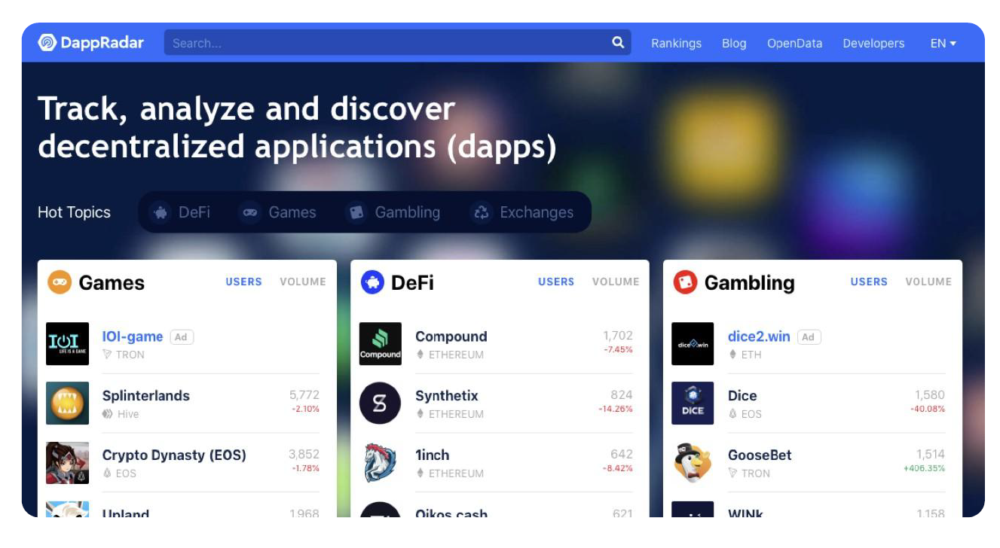
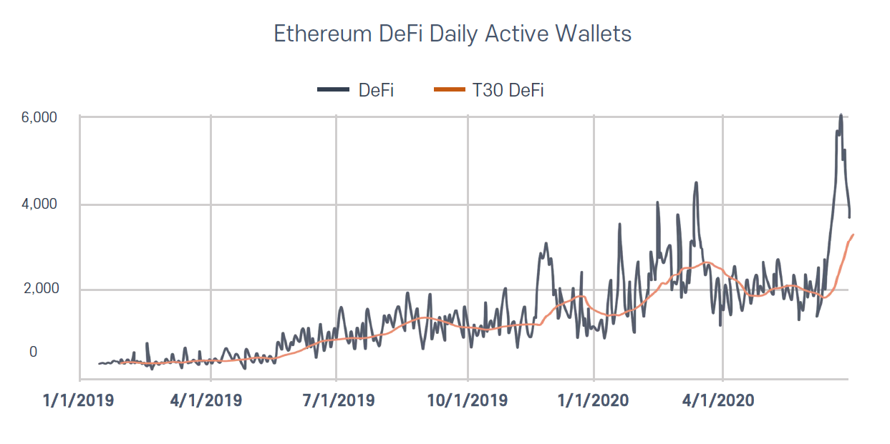
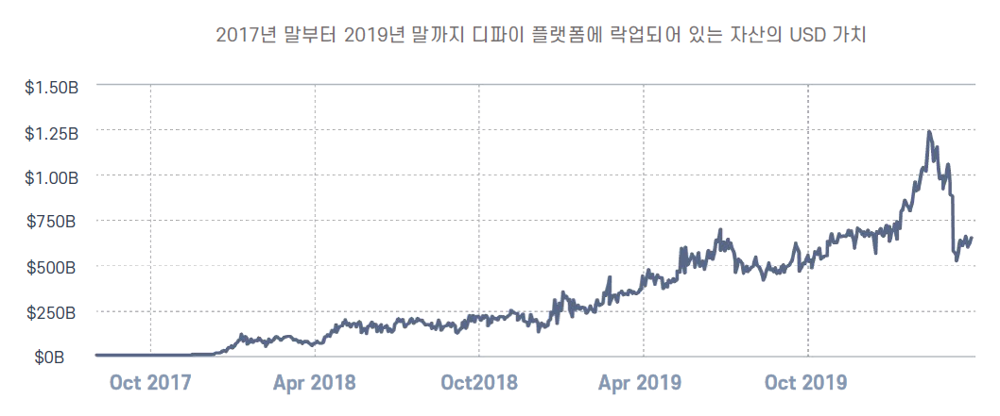
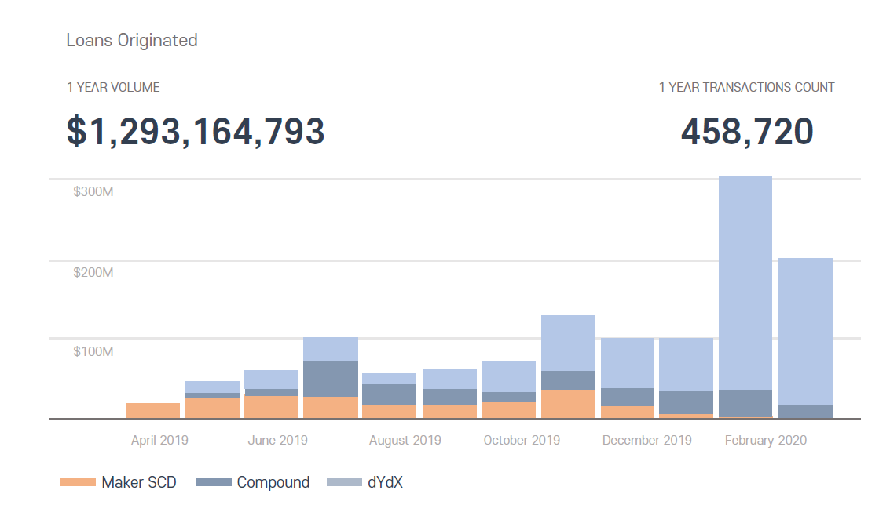
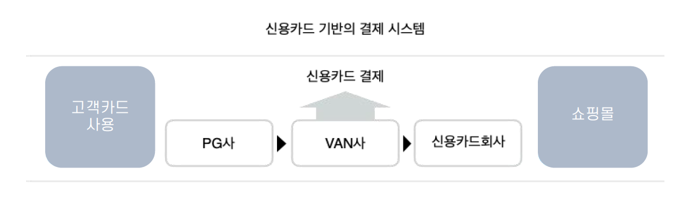

# 시장 환경

## Defi(Decentrialized Finance) 시장의 성장성

블록체인을 탄생시킨 비트코인은 Internet of Money, 디지털 금, 가치저장 등 탈 중앙화 디지털 자산입니다. 10년이 넘게 된 역사 속에서 비트코인은 오늘날 디지털 자산으로 인정받고 있습니다. 비트코인은 발행 주체가 없고 투명한 자산이라는 측면에서 블록체인의 기술을 선보였으나, 이후 출범한 이더리움은 탈중앙화된 스마트컨트랙 기술로 인해 중앙 집권적 금융을 해소할 수 있는 방안으로 인식되고 있습니다. &#x20;

이더리움과 이더리움 계열 프로젝트들은 자동화된 코드를 통해, 중앙화 금융이 하고 있던 부분을 옮겨 오기 시작했으며, 2018년 \~2019년 성장 발전을 통해 2020년에는 블록체인 분야 중 투자자에게 가장 주목 받는 분야가 되었습니다.

수백개의 디파이 프로젝트 중 제일 먼저 두각을 나타낸 것은 **메이커 다오(Maker DAO)**입니다. 메이커다오는 2017년 자체 스테이블 코인인 DAI와 DAI의 가격을 유지하고 수수료를 안정화시키는 MKR코인을 발행하며 탈중앙화 스테이블 코인의 시작을 알렸으며, 1달러에 연동되어 있는 DAI토큰과 담보 부채 (Collateralized Debt Position, CDP)라는 개념을 통해 누구나 사용 가능한 대출 플랫폼을 구축했습니다. ****&#x20;

## **DeFi의 장점**

**-** **탈중앙성(Decentralization)**

전통 금융시장과 디파이는 기능적으로 봤을때 크게 다르지 않습니다. 이 둘의 가장 큰 차이점은 신뢰의 주체입니다. 전통 금융시장이 은행, 정부, 보험회사 등 중앙 기관을 신뢰의 주체로 삼는 반면 디파이는 자동화된 소프트웨어 및 코드 자체가 신뢰의 주체가 됩니다. 중앙 기관이 언제나 악의적인 행동을 한다고 볼 수는 없습니다. 하지만 디파이가 주목하는 것은 악의적인 행동을 할 수 없는 환경을 조성하는 것입니다. 가능성 자체를 차단하는 것입니다.&#x20;

탈중앙성은 전체 시스템의 안정성에도 중요하게 작용합니다. 중앙 주체의 데이터베이스가 아닌, 세계 각국의 노드에 의해 시스템이 운영되기 때문에, 해킹이나 시스템 셧다운의 위협에서 안전합니다.&#x20;

**-** **무허가성(Permissionless)**

무허가성은 말 그대로 누구나 참여 가능한 환경을 의미합니다. 현행 금융 시스템은 상당히 폐쇄적입니다. 경우에 따라서 은행은 고객에게 계좌를 개설하지 않는 경우도 있고, 일부 금융 상품에 가입하기 위해서는 특정한 자격 요건을 요구하는 경우도 많습니다. World Bank는 세계적으로 약 17억명의 성인이 은행 계좌를 갖고 있지 않다고 보고하기도 했습니다. 이는 전체 인구의 20%가 넘는 수치입니다. &#x20;

베네수엘라를 비롯한 남아메리카의 일부 국가에서 비트코인 및 대시가 국가의 법정 화폐보다 활발하게 활용되고 있습니다. P2P송금이 발달한 필리핀을 비롯한 일부 동남아 국가에서는, 복잡하고 제한이 큰 은행 시스템을 뛰어 넘어 암호화폐를 이용한 송금이 퍼지고 있습니다. 금융 시스템이 불안정한 환경일수록 디파이가 갖는 잠재력과 접근성은 확대됩니다.

이들 국가는 이미 실생활에서 은행을 통한 송금 대신, 모바일 기기를 이용한 결제가 더욱 활발하지만, 이는 여전히 핀테크 업체나 통신사에 의해 관리 감독되는 환경입니다. 크립토 업계는 오랜 기간동안 금융 생태계에서 배제된 인구를 유입시키기 위해 노력했으며, 디파이의 발전으로 이는 더욱 가까워질 것입니다.&#x20;

**-** **개인정보** **보호**

투명성과 검열저항성은 개인정보 보호의 측면에서도 많은 장점을 갖습니다. 기존 금융권의 수많은 자격요건에 비해 디파이의 사용자는 개인정보를 공개할 필요가 없습니다.

중앙 기관은 지금까지 너무 과한 개인정보를 요구해 왔습니다. 반면 디파이 생태계에서는 원하는 수준의 개인정보를 원하는 상대방에게 선택적으로 공개할 수 있습니다.

오늘날 개인정보는 단순 프라이버시의 차원에서 생각할 문제가 아닙니다. 세계 데이터 시장은 올해 약 250조원 규모로 성장하고 있으며, 개인정보의 상품화는 가속화 될것으로 보입니다. 디파이를 이용한 신원정보 서비스 역시 근 시일내에 널리 적용될 수 있는 분야입니다.&#x20;

**-** **효율성**

중앙화된 환경에서는 결국 사람이 모든 거래 과정을 결정하고 확인해야 합니다. 핀테크 기술의 도입으로 일부 자동화를 이루었지만 스마트 컨트랙트를 기본으로 하는 디파이와 비교하기는 힘든 수준입니다.

현 금융권에서 국가간 송금에 평균 5% 이상의 수수료를 부과하는 반면, 디파이 환경에서는 1\~2% 미만의 수수료가 책정됩니다. 디파이는 속도의 측면에서도 탁월한 효율성을 갖고 있습니다. 일반적으로 은행을 통한 국가간 송금은 1\~2일이 걸리는 반면, 디파이 생태계에서는 보통의 경우 10분 이내에 모든 거래가 완료됩니다. 언제 어디에서나 자유롭고 간편한 절차를 통해 금융 활동을 이어 나갈 수 있습니다.

**-** **디파이(DeFi)의** **다양한** **활용** **분야**

2018년 말부터 생겨나기 시작한 디파이 서비스는 세계적으로 수백개로 늘어나게 되었으며 랜딩, 스테이킹, 탈중앙화 거래소(DEX), 파생상품, 지갑, 신원확인, 예측시장, 보험 등 다양한 분야에서 활용되고 있습니다. 그동안 여러 기업에서 다양한 dApp들을 선보였지만 실질적으로 적용 가능한 분야는 많지 않았습니다. 디파이는 금융 시스템의 비효율성을 개선하며 블록체인 업계의 많은 호응을 이끌었고, 블록체인을 이해하고 있는 사용자층의 대거 유입으로 단기간에 급격한 성장을 하게 됩니다.

2020년 1분기 현재 전체 이더리움 유통량의 약 3%가량인 300만 이더가 디파이 프로젝트에 예치되어 있습니다. 지난 1년간 전체 디파이 시장에 예치된 이더리움(ETH)의 가치는 2018년 7월 약 2000억원 규모에서 2019년과 2020년엔 각각 4000억원과 1조 3천억원 규모로 성장했습니다. 2년동안 약 1000%가량 증가한 것입니다.

### 2017년 말부터 2019년 말까지 디파이 플랫폼에 락업되어 있는 자산의 USD 가치 환산 차트

2020년 1분기 현재 전체 이더리움 유통량의 약 3%가량인 300만 이더가 디파이 프로젝트에 예치되어 있습니다. 지난 1년간 전체 디파이 시장에 예치된 이더리움(ETH)의 가치는 2018년 7월 약 2000억원 규모에서 2019년과 2020년엔 각각 4000억원과 1조 3천억원 규모로 성장했습니다. 2년동안 약 1000%가량 증가한 것입니다.&#x20;

**- 담보대출(Lending)**

가상자산 담보 대출 서비스는 특정 가상자산을 담보로 받고 다른 가상자산이나 법정화폐를 대출해주는 서비스입니다. 비트코인이나 이더리움 같은 메이저 코인을 담보로 하는 경우가 많습니다. 당장 가상자산에 투자할 돈이 없어도 기존에 보유한 코인을 담보로 대출을 받아 다시 시장에 투자에 참여할 수 있고, 레버리지 효과도 노릴 수 있기 때문에 투자자들 사이에서 각광을 받고 있습니다. 거래소 입장에서도 대출 서비스를 직접 운영해 신규 고객을 유입시킬 수 있습니다.

전 세계적으로 가장 큰 가상자산 대출 플랫폼은 컴파운드(Compound), 메이커SCD(Maker SCD), dYdX 세 곳이입니다. 암호화폐 대출 데이터를 제공하는 ‘론스캔(LoanScan)’에 따르면 이 세 곳에서 최근 1년간 이루어진 암호화폐 대출의 규모는 약 12억9000달러(한화 약 1조 4400억)입니다. 또 데이터 집계를 시작한 2017년 이후 시장은 지속적으로 성장했으며, 지난 2월에는 1월 대비 대출액이 약 세배 증가한 것으로 나타났습니다. 가상자산 시장 침체기에도 대출 규모가 성장했지만 2월 한 달 동안 진행된 활황장에서는 더 많은 대출이 일어난 것으로 파악됩니다.&#x20;

시장이 커지면서 국내에서도 대출 업체와 거래소가 함께 서비스를 운영하는 사례가 늘었습니다.

대부분의 암호화폐 대출은 블록체인을 통해 자동으로 이루어집니다. 청산일이 되면 고객 의지와 상관없이 자동으로 담보자산에서 청산되도록 블록체인 스마트 컨트렉트를 통해 설정합니다. 중개인 없이 시스템상에서 이루어지기 때문에 이러한 대출 형태는 탈중앙화 금융 서비스인 디파이(Decentralized Finance, DeFi)에 속합니다. 반면 거래소에서 중개인이 되고 대출 서비스를 진행하는 경우는 중앙화 금융인 시파이(Centralized Finance, CeFi)서비스라고 합니다. 디파이처럼 대출과 청산이 자동으로 이루어지지는 않지만, 빠르게 이용자를 확보할 수 있도록 각 거래소들이 나름대로의 전략을 세웠으며, 시파이만의 장점을 내세운 것입니다.&#x20;

\- **스테이킹(Staking)**

스테이킹은 암호화폐를 블록체인에 예치하여 데이터 검증에 기여하는 것을 의미합니다. 대부분의 블록체인은 스테이킹에 참여할 경우 리워드를 지급합니다. 비트코인을 비롯한 PoW 컨센서스 모델에서는, 컴퓨팅 파워를 이용한 채굴을 통해 데이터를 검증하고 그에 대한 보상으로 블록 리워드를 지급하는 것과 같은 맥락입니다.&#x20;

2015년 등장한 이더리움은 시작 단계부터 PoS로의 전환을 계획하고 있었습니다.&#x20;

그리고 2017년의 상승장과 함께 다양한 PoS 프로젝트들이 등장하기 시작합니다. 이들은 약 1\~2년의 개발을 거친 후 2018년 말을 기점으로 메인넷을 런칭합니다. 2018년 상반기까지 이오스, 트론, 네오 등으로 대변되던 스테이킹 시장은 이후 급격히 성장하여 전문적인 스테이킹과 노드 검증 업체가 생겨납니다.

대표적인 스테이킹 업체로는 Stake.Fish, Stakewithus, 코스모스테이션(Cosmostation)등이 있으며 바이낸스(Binance), 코인베이스(Coinbase), 코인원(Coinone) 등 중앙화 거래소에서도 스테이킹 서비스를 제공합니다.&#x20;

**-** **파생상품(Derivative)**&#x20;

디파이 생태계의 파생상품은 그 종류가 다양하지는 않습니다. 최근 ERC-20가 아닌 토큰을 연동하는 방법으로 비트코인(BTC), USDT와 같은 페어를 공개하기도 했지만 대부분 고배율 레버리지를 이용한 마진거래가 주를 이룹니다. 대표적인 파생상품 프로젝트로는 dYdX, bZx 등이 있습니다.

아직까지 디파이의 파생상품이 많이 제한적인 이유로는 실물경제와 디파이 시스템의 괴리 때문이라고 생각합니다. 전통 금융권의 파생상품 중에는 농산물, 원자재 등 실물 자산과 밀접하게 연관되어있는 종목이 주를 이루는데, 디파이 환경에 이를 도입하는것은 쉬운 분야는 아닙니다.&#x20;

**-** **스테이블** **코인(Stable Coin)**

암호화폐는 언제나 높은 변동성(volatility)때문에 안정적인 가치 저장소의 역할을 수행할 수 없다는 지적을 받아왔습니다. 하지만 모든 암호화폐의 변동성이 높은 것은 아닙니다. 기존 법정화폐에 페깅되어있는 스테이블 코인은 법정화폐처럼 낮은 변동성을 확보함과 동시에 암호화폐가 가진 탈중앙화의 이점을들 동시에 갖게 되었습니다.

초창기 스테이블 코인은 주로 거래소의 거래 페어나 국제 송금의 용도로 활용되었습니다. 하지만 디파이 생태계의 성장에 따라 스테이블 코인의 쓰임새와 형태에는 급격하게 확대되었습니다.

초창기 스테이블 코인이 대부분 법정화폐를 담보로 잡았다면, 디파이 생태계의 스테이블 코인은 암호화폐를 담보로 한다는 점에서 확연한 차이가 있습니다. 대표적인 스테이블 코인으로는 USDT, TUSD, USDC, 다이(DAI), 리저브(Reserve), 신세틱스(Synthetix), WBTC 등이 있습니다.

**-** **자산** **토큰화(STO)**

실물자산을 토큰화하여 나눈다는 발상으로 시작된 STO는 2018년 가장 큰 이슈 중 하나였습니다. 비트코인을 비롯한 주요 암호화폐가 전통 금융시장에 부분적으로 편입되면서 기존 금융 및 규제기관의 블록체인 재평가를 기대하며 급성장합니다.

초창기 STO 시장은 사치품이나 부동산등 실물자산을 분산하여 소유권을 나눌 경우, 물리적, 시간적 제한 없이 낮은 수수료로 다양한 자산에 투자를 할 수 있다는 점에서 엄청난 각광을 받았습니다.

일반인들은 참여하기 어려웠던 고가의 자동차나 미술품 역시 토큰화하여 분배될 경우 접근성이 높아진다는 측면 역시 탈중앙화에 가깝다는 의견이 지배적이였죠. 하지만 각 국가간 상이한 증권에 대한 규제와 정의 때문에 글로벌 서비스로 발전하는데에는 한계가 있었고 2019년 이후 큰 발전을 보이지는 못하고 있습니다.

대표적인 자산 토큰화 프로젝트로는 시큐리타이즈(Securitize), 폴리매스(Polymath), 멜론포트(Melonport) 등이 있습니다.

## 스마트 결제 시장의 변화

|                              |   |   |
| :--------------------------: | - | - |
|  **구매자와 판매자와의 단순화된 결제 서비스**  |   |   |
| **저렴한 수수료, 쉽고 빠른 결제 시장의 성장** |   |   |

코로나19로 인해 세계 경제 위기에도 불구하고, 글로벌 전자상거래(e-commerce) 시장은 페이먼트 시장의 성장을 선두로 빠르게 성장하고 있습니. 2021년 전 세계 전자상거래 시장의 매출은 약 2조 6,996억 달러에 이를 것으로 예상됩니다. 2025년에는 약 3조 4533억 달러를 돌파할 전망이며, 전 세계 전자상거래 보급률은 지난해(46.60%)보다 4% 넘게 오른 50.8%에 이를 것입니다.

기존 신용 카드 서비스 구조는 PG사와 VAN사를 거쳐 카드사와 고객, 그리고 가맹점간의 네트워크를 구축하여 제공하였습니다. 그에 따라 가맹점의 수수료 부담이 발생하고, PG사와 VAN사는 이 수수료를 받아서 리베이트 하는 형식으로 수익구조가 구성되어 있으며, 이에 카드사 및 가맹점은 수수료 과금이 발생되어, 이는 소비자에게 고스란히 반영되고 있습니다.

하지만, **스마트 결제**는 금융기관(카드사, 은행 등)에서 직접 판매자와 구매자를 이어주고, '전표'시스템이나 '온라인'결제 시스템을 간편하게 다룰 수 있으며, 앱 서비스를 통해 모든 거래내역이 전송되고, 가맹점은 이에 대한 대금을 원활하게 정산이 가능합니다. 기존의 PG사나 VAN사를 거치지 않고도, 금융기관과 직접적인 거래가 가능하여, 카드사 역시 PG사 및 VAN사로 지급할 의무가 있었던 '수수료'로부터 부담을 해소할 수 있습니다. 중개 역할을 최소화했기 때문에 판매자는 수수료를 절감하는 효과가 있고 절감된 수수료 비용을 다시 구매자에게 사은품 및 포인트 등의 또 다른 혜택으로 제공할 수 있습니다.

